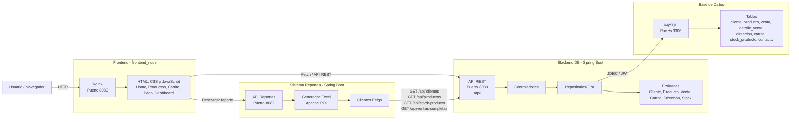

# Ecomarket - Sistema de Gestión de Ventas

Proyecto desarrollado para la gestión de productos, inventarios y ventas, containerizado con **Docker** para garantizar consistencia entre entornos.

## Requisitos
Instalar:
- [Docker](https://www.docker.com/products/docker-desktop/).
- [Git](https://git-scm.com/).
- [NodeJS](https://nodejs.org/en/download).

---

## Cómo ejecutar el proyecto

Para clonar y levantar el sistema:

### 1. Clonar el repositorio
Abre la terminal y ejecuta:

git clone https://github.com/Dariodelagb/Proyecto-Ecomarket-FS3.git

cd Proyecto-Ecomarket-FS3

### 2. Levantar los contenedores

Abre Docker Desktop o systemctl start docker

Para iniciar el proyecto, ejecuta el siguiente comando:

docker-compose up --build

Nota: Esto inicia en secuencia: Mysql -> servicio DB -> npm install -> Frontend -> Reportes. Tarda bastante.

### 3. Acceso al sistema
Una vez que veas en la consola que todos los contenedores están corriendo:

Base de Datos: Mysql accesible en el puerto 3306 y Endpoints accesibles en el puerto 8080

Aplicación: Accesible en http://localhost:8083/.

Servicio de reportes: Accesible en http://localhost:8082/.

---

## Arquitectura del sistema



Flujo principal:

- El usuario entra al frontend en http://localhost:8083/.
- El frontend consume el backend principal usando API REST en http://localhost:8080/api.
- El backend principal lee y escribe datos en MySQL.
- El sistema de reportes corre en http://localhost:8082/ y consulta datos del backend principal para generar el archivo Excel.

---

## Pruebas rapidas con Postman

El repositorio incluye una coleccion Postman lista para importar:

Ecomarket_FS3.postman_collection.json

Variables principales de la coleccion:

- db_base_url: http://localhost:8080/api
- reportes_base_url: http://localhost:8082
- cliente_id, producto_id, categoria_id, stock_id, direccion_id, venta_id y token

Tambien puedes copiar y pegar estos ejemplos directamente en Postman.

### Registrar cliente

Metodo: POST  
URL: http://localhost:8080/api/auth/registro

Body JSON:

```json
{
  "nombres": "Juan",
  "apellidos": "Perez",
  "rut": 12345678,
  "dvrut": "9",
  "email": "juan.perez@example.com",
  "contrasena": "clave123",
  "direcciones": [
    {
      "calle": "Av. Siempre Viva",
      "numero": "742",
      "comuna": "Santiago",
      "ciudad": "Santiago",
      "region": "Metropolitana",
      "referencia": "Casa azul",
      "principal": true
    }
  ]
}
```

Respuesta esperada: devuelve un token de sesion y los datos del cliente creado.

### Iniciar sesion

Metodo: POST  
URL: http://localhost:8080/api/auth/login

Body JSON:

```json
{
  "email": "juan.perez@example.com",
  "rut": "12345678",
  "dvrut": "9",
  "contrasena": "clave123"
}
```

Respuesta esperada: devuelve un token de sesion. Copia ese valor en la variable `token` de Postman si quieres probar la sesion.

### Listar productos

Metodo: GET  
URL: http://localhost:8080/api/productos

Sirve para confirmar que el backend esta leyendo los productos cargados desde la base de datos.

### Agregar producto al carrito

Metodo: POST  
URL: http://localhost:8080/api/carritos/cliente/1/productos/1

Cambia los ultimos valores de la URL si quieres probar con otro cliente o producto:

- cliente: `/cliente/1`
- producto: `/productos/1`

### Crear venta

Metodo: POST  
URL: http://localhost:8080/api/ventas

Body JSON:

```json
{
  "tipoEnvio": "Despacho a domicilio",
  "monto": 25980,
  "cliente": {
    "id": 1
  },
  "direccion": {
    "id": 1
  },
  "detalles": [
    {
      "cantidad": 2,
      "precioUnitario": 12990,
      "fecha": "2026-06-18",
      "producto": {
        "id": 1
      }
    }
  ]
}
```

### Descargar reporte Excel

Metodo: GET  
URL: http://localhost:8082/get-reporte

Descarga un archivo Excel con resumen del dashboard, ventas, usuarios sin datos sensibles, productos con stock y ventas mensuales.

### Persistencia de datos

Si deseas reiniciar la base de datos desde cero (limpiar todos los datos):

docker-compose down -v

docker-compose up --build

El script de inicialización (01-init.sql) se ejecuta automáticamente la primera vez que se crea el contenedor de base de datos.

El contenedor de la aplicación de ventas espera automáticamente a que la base de datos esté lista antes de arrancar.
