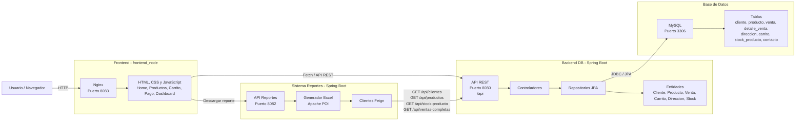

# Pedidos360 - Gestion integral de pedidos

Proyecto para gestionar catalogo, inventario, pedidos, usuarios, auditoria y reportes, containerizado con **Docker** para garantizar consistencia entre entornos.

## Roles y flujo de pedidos

- **Cliente:** consulta solamente sus ultimos pedidos y el estado actual.
- **Operador:** consulta pedidos pendientes o en curso y actualiza sus estados.
- **Admin:** accede al dashboard, ventas, usuarios activos, pedidos y reporte Excel con auditoria.

Flujo permitido: `CREADO -> ACEPTADO -> EN_PREPARACION -> DESPACHADO -> ENTREGADO`. Un pedido puede cancelarse antes del despacho. El stock se descuenta una sola vez al aceptar el pedido.

Usuarios iniciales:

- Admin: `admin@pedidos360.cl`, RUT `11111111-1`, clave `admin360`.
- Operador: `operador@pedidos360.cl`, RUT `22222222-2`, clave `operador360`.

Vistas principales:

- `http://localhost:8083/dashboard.html`: panel exclusivo de Admin.
- `http://localhost:8083/operador.html`: pedidos pendientes y en curso.
- `http://localhost:8083/mis-pedidos.html`: ultimos pedidos del Cliente autenticado.

Los endpoints protegidos usan el header `X-Session-Token`. La descarga del Excel se solicita desde el boton del dashboard y llega desde `http://localhost:8082/get-reporte`; el archivo incluye ventas, estados y registros de auditoria.

## Requisitos
Instalar:
- [Docker](https://www.docker.com/products/docker-desktop/).
- [Git](https://git-scm.com/).
- [NodeJS](https://nodejs.org/en/download).

---

## Cómo ejecutar el proyecto

Para clonar y levantar el sistema:

### 1. Clonar el repositorio
Abre la terminal y ejecuta:

git clone https://github.com/Dariodelagb/Proyecto-Ecomarket-FS3.git

cd Proyecto-Ecomarket-FS3

### 2. Levantar los contenedores

Abre Docker Desktop o systemctl start docker

Para iniciar el proyecto, ejecuta el siguiente comando:

docker-compose up --build

Nota: Esto inicia en secuencia: Mysql -> servicio DB -> npm install -> Frontend -> Reportes. Tarda bastante.

### 3. Acceso al sistema
Una vez que veas en la consola que todos los contenedores están corriendo:

Base de Datos: Mysql accesible en el puerto 3306 y Endpoints accesibles en el puerto 8080

Aplicación: Accesible en http://localhost:8083/.

Servicio de reportes: Accesible en http://localhost:8082/.

---

## Arquitectura del sistema


```mermaid
flowchart LR
    user["Usuario / Navegador"]

    subgraph frontend["Frontend - frontend_node"]
        nginx["Nginx\nPuerto 8083"]
        ui["HTML, CSS y JavaScript\nHome, Productos, Carrito, Pago, Dashboard"]
    end

    subgraph backend["Backend DB - Spring Boot"]
        api["API REST\nPuerto 8080\n/api"]
        controllers["Controladores"]
        repositories["Repositorios JPA"]
        models["Entidades\nCliente, Producto, Venta, Carrito, Direccion, Stock"]
    end

    subgraph reports["Sistema Reportes - Spring Boot"]
        reportsApi["API Reportes\nPuerto 8082"]
        excel["Generador Excel\nApache POI"]
        feign["Clientes Feign"]
    end

    subgraph database["Base de Datos"]
        mysql["MySQL\nPuerto 3306"]
        schema["Tablas\ncliente, producto, venta, detalle_venta,\ndireccion, carrito, stock_producto, contacto"]
    end

    user -->|"HTTP"| nginx
    nginx --> ui
    ui -->|"Fetch / API REST"| api
    ui -->|"Descargar reporte"| reportsApi

    api --> controllers
    controllers --> repositories
    repositories --> models
    repositories -->|"JDBC / JPA"| mysql
    mysql --> schema

    reportsApi --> excel
    excel --> feign
    feign -->|"GET /api/clientes\nGET /api/productos\nGET /api/stock-producto\nGET /api/ventas-completas"| api
```

Flujo principal:

- El usuario entra al frontend en http://localhost:8083/.
- El frontend consume el backend principal usando API REST en http://localhost:8080/api.
- El backend principal lee y escribe datos en MySQL.
- El sistema de reportes corre en http://localhost:8082/ y consulta datos del backend principal para generar el archivo Excel.

---

## Pruebas rapidas con Postman

El repositorio incluye una coleccion Postman lista para importar:

Pedidos360.postman_collection.json

Variables principales de la coleccion:

- db_base_url: http://localhost:8080/api
- reportes_base_url: http://localhost:8082
- cliente_id, producto_id, categoria_id, stock_id, direccion_id, venta_id y token

Tambien puedes copiar y pegar estos ejemplos directamente en Postman.

### Registrar cliente

Metodo: POST  
URL: http://localhost:8080/api/auth/registro

Body JSON:

```json
{
  "nombres": "Juan",
  "apellidos": "Perez",
  "rut": 12345678,
  "dvrut": "9",
  "email": "juan.perez@example.com",
  "contrasena": "clave123",
  "direcciones": [
    {
      "calle": "Av. Siempre Viva",
      "numero": "742",
      "comuna": "Santiago",
      "ciudad": "Santiago",
      "region": "Metropolitana",
      "referencia": "Casa azul",
      "principal": true
    }
  ]
}
```

Respuesta esperada: devuelve un token de sesion y los datos del cliente creado.

### Iniciar sesion

Metodo: POST  
URL: http://localhost:8080/api/auth/login

Body JSON:

```json
{
  "email": "juan.perez@example.com",
  "rut": "12345678",
  "dvrut": "9",
  "contrasena": "clave123"
}
```

Respuesta esperada: devuelve un token de sesion. Copia ese valor en la variable `token` de Postman si quieres probar la sesion.

### Listar productos

Metodo: GET  
URL: http://localhost:8080/api/productos

Sirve para confirmar que el backend esta leyendo los productos cargados desde la base de datos.

### Agregar producto al carrito

Metodo: POST  
URL: http://localhost:8080/api/carritos/cliente/1/productos/1

Cambia los ultimos valores de la URL si quieres probar con otro cliente o producto:

- cliente: `/cliente/1`
- producto: `/productos/1`

### Crear venta

Metodo: POST  
URL: http://localhost:8080/api/ventas

Body JSON:

```json
{
  "tipoEnvio": "Despacho a domicilio",
  "monto": 25980,
  "cliente": {
    "id": 1
  },
  "direccion": {
    "id": 1
  },
  "detalles": [
    {
      "cantidad": 2,
      "precioUnitario": 12990,
      "fecha": "2026-06-18",
      "producto": {
        "id": 1
      }
    }
  ]
}
```

### Descargar reporte Excel

Metodo: GET  
URL: http://localhost:8082/get-reporte

Descarga un archivo Excel con resumen del dashboard, ventas, usuarios sin datos sensibles, productos con stock y ventas mensuales.

### Descargar resultados de pruebas

Metodo: GET  
URL: http://localhost:8082/get-pruebas

Descarga un archivo de texto con comprobaciones del servicio de reportes, consultas principales al backend, resumen del dashboard y generacion del Excel.

Este archivo valida:

- Conexion TCP con MySQL dentro de Docker.
- Respuesta de la API REST del backend en el puerto 8080.
- Consultas principales de clientes, productos, stock y ventas.
- Generacion del Excel de reportes.
- Cobertura de codigo generada con JaCoCo al ejecutar las pruebas unitarias.

Para ejecutar las pruebas del servicio de reportes desde consola:

```bash
cd sistemareportes
./mvnw test
```

En Windows PowerShell:

```powershell
cd sistemareportes
.\mvnw.cmd test
```

El reporte de cobertura queda generado en:

```text
sistemareportes/target/site/jacoco/index.html
```

### Persistencia de datos

Si deseas reiniciar la base de datos desde cero (limpiar todos los datos):

docker-compose down -v

docker-compose up --build

El script de inicialización (01-init.sql) se ejecuta automáticamente la primera vez que se crea el contenedor de base de datos.

El contenedor de la aplicación de ventas espera automáticamente a que la base de datos esté lista antes de arrancar.
# Ejecucion distribuida: backend en EC2 y frontend local

El backend Spring Boot puede ejecutarse directamente en una instancia Linux, sin usar su contenedor. Desde la carpeta `db/db`, configura la conexion a MySQL y arranca el servicio:

```bash
export SPRING_DATASOURCE_URL='jdbc:mysql://HOST_MYSQL:3306/sistema_ventas?createDatabaseIfNotExist=true&serverTimezone=UTC'
export SPRING_DATASOURCE_USERNAME='pedidos360_app'
export SPRING_DATASOURCE_PASSWORD='CAMBIAR_ESTA_CLAVE'
export PEDIDOS360_REPORTES_INTERNAL_KEY='CAMBIAR_ESTA_CLAVE_INTERNA'
sh ./run-linux.sh
```

El script usa `sh ./mvnw`, por lo que funciona aunque Git no haya conservado el permiso ejecutable de `mvnw`. Spring escucha en `0.0.0.0:8080` para recibir conexiones externas.

En el Security Group de EC2 se debe permitir TCP `8080` solamente desde la IP publica del equipo que ejecuta el frontend. Si se utiliza reporteria, se debe permitir tambien TCP `8082` desde esa misma IP. MySQL no necesita quedar expuesto al computador del usuario cuando se encuentra en la misma instancia o red privada que Spring Boot.

El frontend local esta configurado para redirigir por defecto:

```text
/api       -> http://34.231.143.20:8080/api
/reportes  -> http://34.231.143.20:8082
```

Se inicia desde `frontend_node` con `npm start`. Los destinos se pueden reemplazar sin editar codigo:

```powershell
$env:PEDIDOS360_API_TARGET="http://OTRA_IP:8080"
$env:PEDIDOS360_REPORTS_TARGET="http://OTRA_IP:8082"
npm start
```
